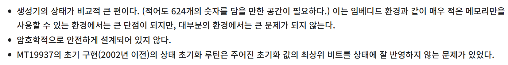

# Encounter : NightDance

**HD-2D Style SRPG Project**
기존 프로젝트의 로직을 개선하고, CS 지식을 바탕으로 더욱 견고한 구조로 리팩토링하여 다시 개발 중인 프로토타입입니다.
3D 라이팅과 셰이더를 활용한 배경 위에 2D 캐릭터가 공존하는 2.5D 그래픽을 지향합니다.

---

## 📅 Roadmap & TODO

현재 프로토타입 재구축 단계입니다.

- [ ] **Core Logic (Refactoring)**: 기존 스파게티 코드 개선 및 이주 (진행 중 🚧)
- [ ] **System**: 맵, 캐릭터, 전투 시스템 핵심 구현
- [ ] **Visual**: HD-2D 느낌을 살린 쉐이더 및 3D 라이팅 적용
- [ ] **UI/UX**: AI를 활용하여 기존 UI 개선 및 적용
- [ ] **Optimization**: 대량의 이미지/에셋 로딩 속도 개선

---

## 🛠️ Dev Log (Development History)

프로토타입 개발 및 리팩토링 일지입니다.

### 2026-01-01
#### 🎥 카메라 시스템
* **Refactor**: 카메라 회전, 줌인/줌아웃 함수 메소드 추출 (모듈화)
* **Feature**: 마우스 입력 기반의 회전 및 줌 조작 기능 추가
* **WIP**: 마우스 기반 이동 로직 구현 중
 

### 2026-02-06
~~새해부터 지금까지 중간에 깃허브 커밋을 한 번도 안했다니 정말로 나쁜 버릇! 😹~~

사실 보안 문제로 Git에는 올리지 않은 Gemini와 Qwen 활용한 개인 에이전트 AI 프로젝트를 진행하느라 많이 못했다.
재미는 있다. Comfy이용해서 이미지 생성, Qwen Vision/Gemini API의 이미지 인식, DB조회, 멀티모달(이미지) 텍스트, 컨텍스트 인식, 등등
며칠 걸려 기능 하나씩 추가하고 버그 고치면서도 나름 새로워서 재밌다. 물론 Gemini가 대부분 해줬지만, 워낙 내용이 길어지니까 Gemini가 자꾸 헛소리를 하기 시작해서 오류 로그 분석 정도 맞기고 문제 인식은 내가 하게 되었다. 파이썬 잘 못하다보니까 많이 어렵다.

이외에도 마인크래프트 베드락에디션 애드온 만들고 있었다. 생각보다 재밌고 상상이상으로 자유도가 제한되어있다. 마소 정책때문에 자바에디션과는 달리 기능을 죄다 막아놔서 뭘 하기가 힘들다.
깃에 올릴까 생각하긴 했는데 생각만 했다.

프로젝트 전체에 큰 변화가 있었다.
23년도 처음 프로젝트를 진행할 때는 클래스 하나에 냅다 때려박고 의존성 문제가 극심했다.
이거 리팩토링하느니 새 프로젝트 파는게 낫지... 라는 생각하다가도 엉성하게 만든게 깃허브에 미완성으로 남아있는게 맘에 안들었다.
그래서 기획부터 코드 최적화랑 아예 리메이크 내지는 이름만 빌린 수준 느낌이라고 보면 된다. 노션에도 페이지 새롭게 만들 예정이다.
졸업작품에서 DB - 백엔드 - 유니티 클라이언/웹 프론트 연동이 높은 평가를 받았는데, 이를 거름삼아 이 프로젝트에 개선해서 넣을 예정이다.
실무 진행은 어떻게 되는지 모르지만 DB쓰면 SO 왜쓰지? 싶어서 제미나이한테 물어보니까 네트워크 연결 안돼도 가능하고 SO 자체가 유니티 런타임 최적이라고도 한다.
그냥 유저 클라이언트 json 캐시해두고 게임 실행마다 네트워크랑 동기화하면 되는거 아닌가? 했는데 보안문제도 있고 뭐 아무튼 안좋단다.

기존에 있던 스토리? 기획?을 전부 엎음. 장르가 같다는 공통점 뿐
요즘 주변에서 SCP 기반 웹소설을 많이 읽던데, 국내 로보토미 코퍼레이션, 라이브러리 오브 루이나, 림버스 컴퍼니(안해봄) 재밌게 했던 기억이 있다.
생각보다 매니아 층도 있고, 진부한 판타지보다는 더 재밌을 것 같기도 해서 골랐다.
어짜피 기존 내용이래봐야 풍설, 삼각전략 파쿠리 내용이었던 것 같아서 그냥 어반 판타지로 진행.

## 1차 커밋
#### 카메라 시스템 개선, 백엔드 연동
* **카메라 개선**:
    - 마우스 기반 이동 로직을 완성함: Swizzle을 이용한 2.5D의 타일맵에 Raycast기반의 마우스 이동을 사용하는 것에 하자가 있음 => Focus오브젝트 위치와 인근 타일의 좌표 정보를 조회해 이동
    - Quad, Plane 기반 오브젝트와 Cinemachine 카메라 렌더링 관련 오류 => 2.5D라서 Sprite로 하니 렌더링 버그가 없어서 좋더라..
    - 기존에는 비어있는 타일은 접근할 수 없게 해놨는데, 파엠 인게이지 하면서 보니까 접근하게 하는 게 맞는 것 같길래 접근 가능하게 풀음.
* **유닛 데이터 이사**:
    이제부터 본격적으로 진행할 내용인데, 기존 구조가 다소 재앙에 가까울 정도로 엉망이다. ~~(3년전...🙄)~~
    Scriptable Objects 이용해서 데이터 베이스 잡고, 기존과 달리 인터페이스 분리하고 데이터도 OOP적으로 좀 고쳐나갈 예정!
    - UnitData(SO) 클래스 생성: 기본 스탯, 성장치, 유닛 아이디 정도가 담긴다.
        -  유닛 아이디는 기본 데이터 구분(몬스터 헌터의 골격 베이스마냥)으로 두고 사용한다.
            - 로보토미 코퍼레이션처럼 쓰고 버리는 마인드의 유닛
    - UnitDataDTO(SO) 클래스 생성: 백엔드에서 API로 받아온 JSON데이터를 넣는다.
    - 분리의 이유: UnitData(클라용)와 UnitDataDTO(서버용)을 분리한 이유는 클라용 SO에 서버에서는 담지 않는 데이터를 넣을 수 있고, Dictionary가 인스펙터에서 안보이기 때문!
    - 피해를 받을 수 있는 오브젝트 분리 등: OOP좀 공부하니까 interface 존재의의에 대해 알게되었다. 기존에는 그냥 bool넣고 조건문 더럽게 넣었는데, 훨씬 낫다.
    - 기타 등등...😵
* **Addressables**:
    기존 프로젝트는 Resources.Load썼는데, 메모리 적재가 최악이라는 걸 알면서도 File, Streaming쓰기 싫어서 썼다.
    그렇게 있다보니 Addressables라는 유지보수도 좋고 의존성 문제도 해결해주고 에셋 관리의 장점덩어리 라이브러리가 생겼다.
    졸업 작품 할 때 몇 번 써보긴 했지만, 워낙 팀부터가 문제가 많던 팀이라 프로젝트 극히 일부에만 적용했었다.
    쓰기는 어렵지만 확실히 써보면 장점이 느껴지는 라이브러리?
    - **이제 시작!🤓**

~~README쓰는 시간이 생각보다 길다. 일기쓰는 느낌~~

## 2차 커밋
#### Backend-SO-Addressables연동
* **Scriptable Object**:
    - **UnitDataDTO**: 유닛의 데이터를 서버에서 받아와 담는 일회용 SO, 데이터 동기화 후 자동 삭제된다.
    - **UnitData**: 유닛의 기본적인 데이터가 담기는 SO, 동기화시 DTO를 기반으로 동기화(초기화)된다.
    - 성장 데이터는 nullable이라 TryGetValue를 하도록 바꾸었다.
* **UnitDataSyncEditor**:
    - **Editor**: 유닛 데이터 동기화를 위한 커스텀 메뉴와 동기화 기능이 담긴 에디터이다.
        - 추후에 다른 데이터도 늘테니까 천천히 확장할 예정이다. 동기화는 체크박스로 고르고 한 번에 동기화하게끔 하면 될 것 같다.
* **Addressables**:
    - **AddressableEditorUtility**: 별도의 유틸리티 파일로 분리시켰다. UnitData뿐 아니라 Addressables를 코드를 통해 동기화하도록 했다.
        - UnitDataSyncEditor와 함께 사용하는데 있어 CreateInstance를 해도 name이 안나오길래 고생좀 했는데, Save+Refresh를 먼저 하니까 됐다.
 

### 2026-02-23
ToyGemini나 마인크래프트 모딩을 요즘 더 중점적으로 하다보니 포트폴리오 준비를 다소 못한 감이 있다.
그러다보니 별로 추가한게 없는데 커밋 하는게 맞나? 이 생각이 매 작업할 때마다 들어서 굉장히 늦었다.
할아버지 49제도 좀 껴있고 하다보니 다소 바빴다.

* **FieldManager 추가**
    - 기존에는 GameManager에서 그냥 gridMap을 받아와서 사용했다. 굳이 말하면 TileMap이라는 별도의 2차원 배열 클래스를 만들어 사용했던걸로 기억한다.
    - FieldManager는 기존과 비슷하기는 한데 단순 이차원 배열은 20x20의 타일만 해도 400의 메모리 점유가 있으므로 조금 다른 식으로 해보고자 한다.
        - 아직까지는 구상일 뿐이지만 접근하지 못하는 타일은 단순히 튜플을 갖는 1차원 배열로 만들어도 되지 않을까 생각한다.
        - 또한 이미 오브젝트가 올라가 있는 타일은 Dictionary를 통해 O(1)로 접근할 수 있게 하고자 한다. 현재는 GameObject를 리턴하게끔 했는데, 타일점유 오브젝트 전용 클래스나 인터페이스를 만드는 것도 괜찮을 것 같다.
            - 커밋되지는 않았던 내용이지만 List<KeyValuePair<Vector2Int, GameObject>>로 되어있었다. O(n)이고 KeyValuePair를 사용할 거면 그냥 Dictionary가 낫지 않나? 해서 바꾸었다.
* **기존 UI 사용**
    - 기존에 있던 UI는 스크립트가 좀 지저분하긴 하지만 하이어라키에 구조화는 꽤 잘되어있던것 같다. 그래서 오리지널 프리팹으로 분리하고 개선해보고자 한다.
* **스탯 확인용 인스펙터 UI 추가**
    CustomEditor부분은 솔직히 잘 쓸 줄 모른다. 자바 공부할 때 Swing같은 거 몇 번 써봤기에 대충 구조는 알겠지만 원하는대로 막 다루기란 쉽지 않았다.
    그래서 Gemini의 도움을 받았다.
    - Stat을 표시해주는 인스펙터 데이터 추가
        - Stat이라는 클래스를 쓰는 모든 데이터는 일단 [field: SerializeField]로 표시되게끔 했다.
* **성장 관련 로직**
    - UnitData에 레벨은 따로 안넣었었다. UnitStat에서 레벨을 관리하는게 맞다고 생각한다.
        - 파이어엠블렘처럼 최대경험치는 100이다. 단, 처치한 유닛과의 레벨 차이를 바탕으로 획득 경험치량에 조정을 둘 것이다.
        - 최대레벨은 우선 보수적으로 20만 잡았다. 원래는 최대레벨을 두지 않을 생각이었지만 밸런스 감당이 안될 것 같아서이기도 하고, 나중에 기획에 따라 다르긴 하다.
        - 최대레벨도 나중에 GameRule같은 SO에다가 둘지도 모른다. (일단은 const)
    - 성장률은 누적되게끔 했다.
        - 가령 체력 성장률이 20인데, 이번 레벨업에서 성장하지 못했을 경우 20+20으로 총 40이 된다. 이는 성장할 때까지 누적된다.
        - 누적되는 성장률은 100을 넘지 않는다. 90+90 = 180인데, 1확정 성장 + 80%로 추가 성장이 아니라는 뜻이다.
            - 단, 애시당초 성장률이 100을 넘는 경우는 확정적으로 성장 + 확률로 적용했다.
                - 체력성장률이 260일 경우, 레벨업시 체력 2상승 + 60%확률 => 60%실패시 260+60=320(cap:100) 2상승 + 1상승이되며 320-300의 20은 무시된다.
    - 파이어엠블렘 인게이지에는 이런식으로 성장률 보정이 있는 걸로 알고있다. 유저 경험을 생각하면 이게 맞는 것 같다.
    - 레벨 차이에 따른 경험치 획득량 조정과 누적 성장률 부분은 게임 난이도를 높인다면 아예 없애거나 할 수 있게 할까 생각중이다.
        - 가령 저난이도 게임은 레벨차이에 따른 경험치 보정이 없을 것이고, 누적 성장률은 그보다도 조심스럽다.
* **ObjectHealth/Mental, IDamageable/_M 구조 변경**
    - ObjectHealth와 Mental은 거의 비슷한 구조를 지녔다. 아직 기능이 덜 추가되긴 했지만 공통되는 부분은 묶어서 분리하는게 좋은 습관이다.
        - ResourceStat이라는 별도의 추상 클래스로 분리했다. 값 변화에 관한 로직은 추상함수로 상속받는 ObjectHealth나 Mental이 구체화시키게끔 하였다.
    - 본래는 ObjectHealth는 IDamageable인터페이스를 상속받았다. 그 안에서 IsDead나 TakeDamage등을 처리했기 때문이다.
        - IDamageable은 오로지 TakeDamage만을 넣어놨다. 피해를 입는 객체를 위한 인터페이스이기 때문에 IsDead나 IsAlive, 등은 ObjectHealth쪽으로 빼는게 맞다고 판단했다.
            - IDamageable은 이 객체는 피해를 받을 수 있다는 것 뿐이므로 해당 인터페이스는 UnitStat이 직접 상속받는다.
            - 현재 계획으로 정신력이 없는 유닛도 만들 것 같기 때문에 해당 클래스는 VitalUnitStat으로 두었고, 정신력이 포함된 유닛은 그와 더불어 IDamageable_M을 상속받은 UnitStat 클래스로 만들었다.
* **버그 수정**
    - Stat의 baseValue를 설정해도 Value값이 초기화되지 않는 버그를 수정
        - 초기화시 Dirty 세팅을 안해주었던것이 화근

### 2026-02-26
확실히 Gemini가 도움이 많이 된다. 향상된 구글링 같은 느낌이다.
기존에는 내가 의도한 바를 대중적인 키워드로 치환해서 검색하고 그 결과에서도 추리고 추려서 겨우 양질의 정보를 찾아야 했다면, 그 과정이 생략된 느낌이다.
이번에 발생한 2.5D의 Raycast문제로 인해 3차원과 2차원의 Raycast는 Intersection을 해도 딱히 해결이 되지 않던 문제였다.
그래서 하나의 아이디어로 타일맵의 위치에 면을 깔고 그 면에 충돌체를 넣고 raycast를 쏘면 되지 않을까? 라는 생각을 Gemini에게 제공했더니,
해당 아이디어와 유사하면서도 더 발전된 Plane을 이용한 기하학적 Raycast 방식을 알려주었다.
덕분에 Plane raycast라는 이름으로 검색을 시작헀고 자료들을 찾을 수 있었다. 심지어는 공식 문서도 있었다.
[Plane 레이캐스트](https://rito15.github.io/posts/raycast-to-plane/)
방식은 벡터 내적을 이용한 방식이다.

* **RouteRenderer(LineRenderer)**
    - 파이어엠블렘을 하다보면 경로를 화살표로 보여준다. revamp이전에도 하려다가 그 당시에는 어떻게 구현을 해야할 지 잘 몰라서 포기했었으나 A*로 경로를 탐색하고, 경로의 방향성이 달라지는 위치에 점을 찍고 LineRenderer를 이용해 시각화하면 될 것으로 보인다.
        - 일단은 LineRenderer만을 이용해서 대략 어떻게 보일지 해봤는데 괜찮은 것 같다. 다음에는 A*와 연결하면 될 것 같다.

* **타일 Raycast**
    - 지금의 프로젝트는 마치 사람이 보드게임판을 보는 것처럼 비스듬하게 위에서 보는 형식이다.
        - Grid의 Swizzle은 XZY이고 Tilemap은 XZ이다.
        - Physics2D와 Physics의 Raycast는 현재 프로젝트의 카메라와 타일맵에 상성이 좋지 않았다.
        - 해당 문제는 Plane과 Plane.Raycast를 이용해 해결할 수 있었다.
            - 코드에 주석을 달았지만, 간단히 말하면 레이캐스트 자체가 벡터를 활용한 기능이기에 선에서 충돌체를 찾는게 아니라 충돌체에서 선으로 가는 것이다.
                - 조금 더 자세히, Plane의 방향을 위로, 위치는 타일맵의 y좌표가 0이므로 0으로 한다.
                - Plane.Raycast를 이용해 교차할 선(무한한 길이의 screen point to ray)을 넣고 출력될 out float h를 넣는다. h는 해당 선의 origin부터 plane까지의 distance이다.
                - distance인 h는 Ray.GetPoint의 인자로 사용하여 마우스의 좌표(ray의 direction)방향으로 h만큼 발사했을 때의 좌표를 반환한다.
            - 기존의 Physics를 통해 사용하던 Raycast와는 달리 타일맵을 무한히 확장시킨 plane을 미리 정해주고 ray와 상호작용하는 방식이기에 에러가 발생하지 않았다. 콜라이더 관련 이슈 포함.
            - Physics의 물리연산을 거치지 않고 단순히 수학 계산만으로 진행되기에 가볍다.
            - Swizzle이랑 상관이 없어 더 편하다.
            - 해당 방식을 이번에 처음 사용했지만 몹시 편하고 성능도 좋아서 자주 이용하게 될 것 같다.
    - 해당 방식은 Update가 아닌 InputAction을 이용해 마우스 포지션 변경을 기준으로 작동하게끔 하였다.
        - event 방식이기도 하고 Update는 움직임이 없더라도 매 프레임 작동하니 InputAction의 Mouse Position 방식이 나을 것 같다.

### 2026-03-03
드디어 본격적으로 유닛 조작 관련 설계와 진행을 시작했다.
지금까지 스파게티 코드가 많았기 때문에 최대한 기술적인 관점에서 접근하기로 했다.
파이어엠블렘은 고정 난수가 상징이기도 하다. 천각의 박동이나 용의 시간석을 사용해서 시간을 돌려도 난수는 고정되어 같은 행동은 같은 결과를 낳는다.
이 부분은 난수를 따로 담아서 꺼내고 다시 저장하는 스택형식의 난수배열을 만드나? 했지만 파이어엠블렘 내부에서 어떻게 하는 지는 모르겠지만, 동일한 기능을 할 수 있는 더욱 좋은 알고리즘이 있다는 것을 알게되었다.
[유사 난수 생성기](https://ko.wikipedia.org/wiki/%EC%9C%A0%EC%82%AC%EB%82%9C%EC%88%98)
유사 난수 생성기는 완전한 난수 생성기가 아니다. 수식에 따라 달라지기는 하는데 난수를 흉내내는 알고리즘이다. 암호학적으로 안전한 난수 생성기도 있다지만, 지금 사용하려는 목적과는 부합하지 않으므로
선형 합동 생성기를 이용하기로 했다.
[선형 합동 생성기](https://ko.wikipedia.org/wiki/%EC%84%A0%ED%98%95_%ED%95%A9%EB%8F%99_%EC%83%9D%EC%84%B1%EA%B8%B0)
[메르센 트위스터](https://ko.wikipedia.org/wiki/%EB%A9%94%EB%A5%B4%EC%84%BC_%ED%8A%B8%EC%9C%84%EC%8A%A4%ED%84%B0)
위키에서 메르센 트위스터가 성능 속도면에서 좋다고는 하는데 나눔수를 2^32로 설정하여 오버플로우로 나머지 계산을 하므로 나눗셈 처리가 없어서 선형 합동 생성기가 현재 더 좋다고 판단했다.
게다가 메르센 트위스터는 구현이 어렵다고 한다. 아마 메르센 트위스터가 좋다는 건 정밀한 과학 연구 같은 경우이고 지금 프로젝트는 단순히 확률 처리를 위한 것이니까

624개의 정수 배열이 필요하기 때문에 이 프로젝트에서는 그냥 선형 합동 생성기가 낫다.

구조는 조금 복잡하다. 메멘토와 커맨드 패턴을 이용해서 기본적인 유닛 행동을 구성했다. 아마 옵저버를 이용해 움직임을 구독하고 이벤트를 연동시킬 것 같긴 하다.
천각의 박동 시스템을 구현하기 위해 메멘토를 적극적으로 채용했고 스냅샷을 구성하기에는 커맨드가 가장 적합했다.

다소 스크립트의 개수는 많아졌지만 이렇게 네임스페이스와 스크립트를 분리해서 사용하는 게 나중에 유지보수 측면에서는 더 좋다고 하고, 헷갈리는 부분은 주석으로 그때그때 자세히 기입해놓으면 나중에 안헷갈리지 않을까

* **커맨드**
    - 커맨드 패턴을 이용해 유닛의 행동을 결정한다.
    - CommandInvoker가 커맨드를 받아서 실제 실행시킨다.
        - Invoker 안에는 커맨드 인터페이스가 Undo와 Redo스택에 쌓이며 각각 command의 Undo와 Redo를 실행시킨다.
            - 일반적으로 Undo시 Redo에 작업 스택이 쌓이고 Redo를 하지 않고 새로운 작업을 할 경우 Redo가 비워지기에 ExecuteCommand에 Redo를 비우게끔 하였다.
        - 커맨드의 영향역시도 기록해야 하기에 상태를 저장할 스냅샷과 메멘토(레코드)도 작성하였다.

* **메멘토**
    - 메멘토라는 이름은 아니고 레코드라서 명명해두기는 했지만 메멘토 패턴이다.
    - 메타데이터를 딕셔너리로 담게하였다. 해당 히스토리가 어떤 내용인지를 보다 쉽게 파악하기 위해서 넣었다.
    - 스냅샷이 담겨있는데, 스냅샷은 유연하게끔 해야 하므로 스냅샷의 인터페이스로 넣었다.

* **스냅샷**
    - 기본은 ISnapshot이다. 기본적으로 담긴 내용은 추상 프로퍼티인 대상의 인식 id와 버전이다.
        - 버전은 나중에 스냅샷 데이터의 규격이 달라질 경우 호환 로직 작성을 위해 넣었다.
    - Stat은 StatModifier에 의해 변동이 일어나기 때문에, 단순히 값만 넣으면 반드시 오류가 발생할 것이므로
        - ModifierSnapshot 구조체를 추가하였다.
            - 구조체로 작성한 이유는 클래스로 만든 StatModifier를 깊은 복사 해오는 것에는 추후 소멸 문제와 참조문제가 생길 것을 우려하여 값 타입의 구조체로 만들었다.
            - 구조체 생성자까지 작성해두어 구조체 생성을 보다 쉽고 안전하게 할 수 있다.
        - UnitStatSnapshot은 인터페이스에서 설명한 부분의 외의 내용으로 기본 BaseValue, ModifierSnapshot 배열, 그리고 ModifierCount와 ReadOnlySpan으로 만든 스냅샷 컨테이너가 있다.
        - 아마도 스탯스냅샷은 많을 것으로 예상되어 매번 생성하는 것이 아닌 오브젝트 풀링을 이용하기로 했다.
            - C# 8.0부터는 System.Buffer의 ArrayPool로 오브젝트 풀링 구현을 직접하지 않아도 된다고 하길래 사용해보았다.
            - 단순 생성자가 아닌 초기화용 함수를 별도로 구현하였다. 이 역시도 오브젝트 풀링은 때마다 생성자가 아니기에 초기화 함수를 만든 것이다.
                - 초기화 함수의 mods 지역변수는 루프 내에서 stat을 직접 찾아 .modifiers를 가져오는 것은 오버헤드가 발생할 것이라 생각되었기 때문이다.
                    - 물론 고성능의 현대적인 컴퓨터는 문제가 없을 거라고 생각하지만, 그래도 줄일 수 있는 부분은 개발할 때 감수하고 최적화하는게 맞다고 생각한다.
                - 최적화를 가능한 신경 쓰려고 하다보니 반복문에서 count 변수도 따로 만들었다. List의 Count는 프로퍼티라서 참조 오버헤드가 발생한다.
                - 이런 로직에서 힙 메모리를 많이 들락날락 하는 게 좋은 건 아니니까...
        - 오브젝트 풀링의 해산?도 Dispose함수를 별도로 구현해두었다.
        - ModifierSnapshotData 구조체의 소스 id는 소스측의 HashCode를 이용하기로 했다.
    - Mental도 해야하긴 하지만 우선은 Vital Snapshot만 만들었다.
        - 모든 Stat에 하는 것은 아니고 Vital과 Mental은 IsAlive, IsDead, IsContaimination과 같은 추가적인 데이터와 로직이 있기에 별도로 뺐다.
        - 초기화는 그냥 base(StatSnapshot)의 것을 그대로 사용하고 추가 초기화 로직만 있다.

* **셀 좌표**
    - 셀 좌표는 좌측 상단을 (0, 0)으로 우측 하단이 최댓값이다.
        - 방향에 대한 고민은 많이 했는데 그냥 글이랑 똑같이 좌상단에서 우하단방향으로 결정했다.
        - 셀 좌표를 사용하는 측이 아무래도 UnitController가 될 것 같았다
            - 이미 FieldManager에서는 IFieldObject로 느슨하기는 해도 참조중이다.
            - 그러므로 상호참조를 일으키지 않기 위해서 중재자 패턴을 이용할까 생각하기도 했지만, 난잡해질 것 같아서 유닛 컨트롤러는 명령을 내리는 것이 아니라 명령의 결과? transform의 포지션 변경 이런거?를 맡게끔 하였다.
            - FieldManager는 오로지 필드 관련 정보와 메서드만 갖는게 SRP관점에서 맞다.
            - MoveCommand에 필드매니저를 생성자로 받고 있는데 이 부분은 교체할 예정이다.
                - 일단 작동하는지 테스트를 위해 넣었다.
                    - 잘 된다.
            - 아마 조작은 InputHandler를 따로 만들어서 InputAction이랑 연결해서 쓸 것 같긴 한데, 지금은 GameManager에 넣었다. 테스트를 위해서다.
                - 오로지 아키텍쳐만 짜다보니 지루해서 조금 테스트를 원했다...
            - clamp를 이동 조건식에 그대로 넣었는데 이것도 별도의 함수로 분리할 것 같긴 하다.
                - Utility 네임스페이스로 빼서 넣는 것도 좋아보인다.
            - 아직 스냅샷을 구체화하지는 않아서 Undo와 Redo가 작동하지는 않는데 일단은 CommandInvoker에 커맨드 기록이 차곡차곡 쌓이게 해두었다.

* **선형 합동 생성기**
    - 유사 난수 생성기의 일종으로 다음 값을 예측할 수 있으며 마지막 값만 알아도 처음부터 끝까지의 난수를 예측할 수 있다.
    - 해당 부분이 중요한 것은 아니고, 고정형 난수가 필요했다는 게 핵심이다.
        - 유사 난수로 진짜 난수는 아니라서 시간을 시드로 갖는 기존 난수 생성 알고리즘과 달리 생성 시점에서 순서가 정해져있다. 그래서 Undo를 하고 같은 행동을 하면 결과는 같다.
            - 파이어엠블렘의 천각의 박동과 용의 시간석이 같은 결과를 가져오는 것을 구현하고자 하였다.
                - 처음에는 난수를 배열로 만드나? 했는데 그러면 메모리 낭비가 심할 것 같았다.
                - 그래서 나온 대안이 유사 난수 생성기이다.
            - 당일 개요에서 미리 설명한대로 선택한 사유는 그러하다.
    - 싱글톤으로 구현하여 난수를 사용하는 로직이라면 꺼내 쓸 수 있다.
    - 그런데, 사실 개발 기획에서 확률 부분은 조금 줄이고자 하였기 때문에 사실 별로 쓸 일이 없을 수도 있다.
    - 그냥 이런 것도 있구나 하고 넘어가는 수준에서 일부러 구현한 감이 있다.
    - 음수는 없기에(유니티 엔진도 아니며) uint로 작성했고 4바이트 정수형이기에 2^32가 넘어가면 오버플로우로 0이 된다.
        - 선형 합동 생성기는 나머지 계산이 필요한데, 나눔수를 2^32로 설정하면 오버플로우시 알아서 0이 되기에 나머지 계산을 할 일이 없다.
            - 원래는 컴퓨터는 나눗셈 계산이 무거운 작업에 속하기 때문에 2 << 32로 비트연산을 생각했는데, 생각해보니 레지스트리에서 알아서 오버플로우를 해주니 그냥 나눔값을 2^32로 했다.
                - 근데 C#에서 int가 4바이트지만 나중에 바꾼다면 문제가 생길 것 같긴 한데, size_t같은게 있나 찾아봐야겠다.

* **기타**
    - 또 뭐 했는지는 솔직히 잘 기억 안난다. git을 자주 업데이트 하지 않다보니..
    - status를 보니 IMovable로 이동 가능한 오브젝트 인터페이스를 분리했다.
    - IFieldObject는 기본 정적인 오브젝트라고 생각하면 될 것이다.

### 2026-03-08

* **카메라 이동 로직 수정**
    - 기존 카메라 이동은 테스트용이라고는 하나 단순히 좌표값을 보정해주는 정도였다.
    - 유닛의 이동을 GetTilePos로 타일 위치좌표를 입력해서 월드 좌표로 보정하는 기능을 사용하므로 이와 통일성을 주고자 하였다.
    - 겸사겸사 필드의 좌표를 완전히 Vector3.zero로 맞추었고, 그러다보니 유닛과 포커스의 좌표 또한 꼬이게 되었다.
    - 유닛은 다행히 GetTilePos를 통해 작동하므로 최종 position에 0.5씩 오프셋을 주면 해결되었다.
    - 카메라도 마찬가지로 0.5 오프셋을 주면 되겠지만, 기존의 코드는 마우스 위치를 매번 추적하기도 하였고 키보드 조작도 비슷하게 지저분 했다.
        - 가장 먼저 Clamp관련 로직을 ClampedPos로 합쳤으며, 이는 FieldManager의 static한 함수로 하였다.
            - 필드 좌표에서 입력값이 필드의 영역 밖인지를 판단하기에 FieldManager에 넣는게 맞다고 생각했고, 어디서든 사용할 수 있고 fieldSize를 이용하기에 static한 함수로 설계했다.
        - 다음으로는 포커스의 기본 보정이다.
            - 처음에는 오로지 정수로 변환 후 보정을 하려 하였으나, 기본 축이 틀어져있기 때문에 정수화 이전에 미리 보정을 하여야 했다.
            - 다음으로는 테스트 필드 기준 타일과 동일하게 맞추기 위해 위치 보정을 해야했다.
                - 타일의 좌상단은 원래 0,0이 아니기 때문에(보통은 중간이 0,0) 중심점으로부터 xMin과 yMax의 값을 통해 보정을 해야 했다.
                - 또한 좌상단부터 우하단으로 커지는 좌표이기에 최소값이 0,0이므로 Mathf.Abs를 통해 좌표 꼬임을 해결했다.
        - 포커스의 기본 보정 이후 유닛과 마찬가지로 GetTilePos를 통해 월드 좌표를 받아 포커스 좌표를 적용했다.
        - 기존에는 마우스 조작 -> 포커스 움직임 -> 위치 보정이었다면
            - 마우스 조작 -> 포커스 움직임 -> 포커스 보정 -> 해당 타일 좌표 -> 월드 좌표 적용의 순서를 겪게 된다.
                - 이는 오버헤드가 조금 더 늘어나지만, 단순 포커스 위치 보정은 코드의 일관성이 떨어지고, 유지보수가 난감하다는 문제가 있어 지금 빠르게 해결하였다.
    - 카메라 컨트롤러에 fieldManager를 추가하였는데, 딱히 상호참조될 염려가 되지 않아 괜찮을 듯 싶다.

### 2026-03-09

* **Focus 관련**
    - focus의 초기 위치가 0, 0으로 이동되도록 수정
    - 마우스 이동 후 focusPos가 정상적인 위치로 기록되지 않는 문제 해결
        - 잘못된 값을 대입하고 있던 문제를 수정
    - FieldManager의 SetUnitPos는 더 이상 사용되지 않음 Obsolote처리
        - MoveCommand로 일관성 확보